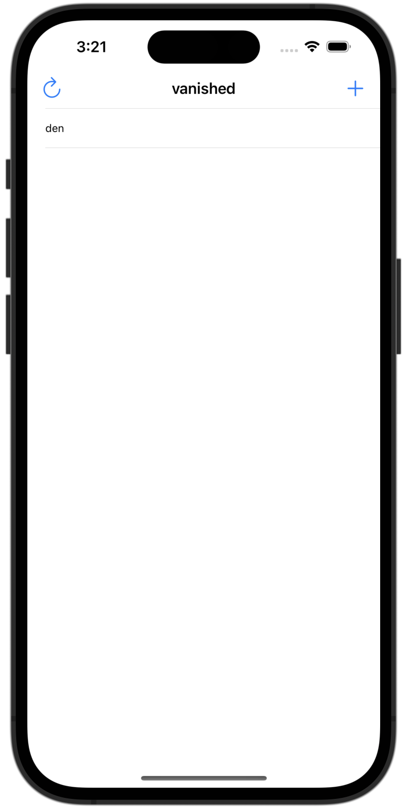
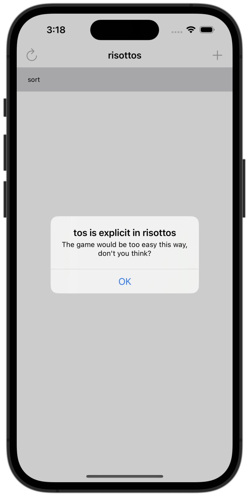

# Word Scramble

[Project 5](https://www.hackingwithswift.com/read/5/overview) from the [100 Days of Swift course](https://www.hackingwithswift.com/100) by [Hacking With Swift](https://www.hackingwithswift.com/).

## Contents

|                      Day                      | Contents                                                                                                                                                                                                                                                                                                                                                                                                                                                                                                              |
|:---------------------------------------------:|:----------------------------------------------------------------------------------------------------------------------------------------------------------------------------------------------------------------------------------------------------------------------------------------------------------------------------------------------------------------------------------------------------------------------------------------------------------------------------------------------------------------------|
| [27](https://www.hackingwithswift.com/100/27) | <ul><li>[Capture lists in Swift: what’s the difference between weak, strong, and unowned references?](https://www.hackingwithswift.com/articles/179/capture-lists-in-swift-whats-the-difference-between-weak-strong-and-unowned-references)</li><li>[Setting up](https://www.hackingwithswift.com/read/5/1/setting-up)</li><li>[Reading from disk: contentsOfFile](https://www.hackingwithswift.com/read/5/2)</li><li>[Pick a word, any word: UIAlertController](https://www.hackingwithswift.com/read/5/3)</li></ul> |
| [28](https://www.hackingwithswift.com/100/28) | <ul><li>[Prepare for submission: lowercased() and IndexPath](https://www.hackingwithswift.com/read/5/4)</li><li>[Checking for valid answers](https://www.hackingwithswift.com/read/5/5)</li><li>[Or else what?](https://www.hackingwithswift.com/read/5/6)</li></ul>                                                                                                                                                                                                                                                  | 
| [29](https://www.hackingwithswift.com/100/29) | <ul><li>[Wrap up](https://www.hackingwithswift.com/read/5/7/wrap-up)</li><li>[Review for Project 5: Word Scramble](https://www.hackingwithswift.com/review/hws/project-5-word-scramble)</li>                                                                                                                                                                                                                                                                                                                          |

## I've learnt...

- Reloading table views
- Inserting rows
- Text input in alerts
- Strings and UTF-16
- Closures
- `NSRange`

## Challenges

Taken from [here](https://www.hackingwithswift.com/read/5/7/wrap-up):

>- [x] Disallow answers that are shorter than three letters or are just our start word. For the three-letter check, the easiest thing to do is put a check into `isReal()` that returns false if the word length is under three letters. For the second part, just compare the start word against their input word and return false if they are the same.
>- [x] Refactor all the `else` statements we just added so that they call a new method called `showErrorMessage()`. This should accept an error message and a title, and do all the `UIAlertController` work from there.
>- [x] Add a left bar button item that calls `startGame()`, so users can restart with a new word whenever they want to.
>- [ ] ([Day 49](https://www.hackingwithswift.com/read/12/5/wrap-up)) Modify project 5 so that it saves the current word and all the player’s entries to UserDefaults, then loads them back when the app launches.
>- [x] Bonus: Once you’ve done those three, there’s a really subtle bug in our game and I’d like you to try finding and fixing it. To trigger the bug, look for a three-letter word in your starting word, and enter it with an uppercase letter. Once it appears in the table, try entering it again all lowercase – you’ll see it gets entered. Can you figure out what causes this and how to fix it?

## Screenshots

