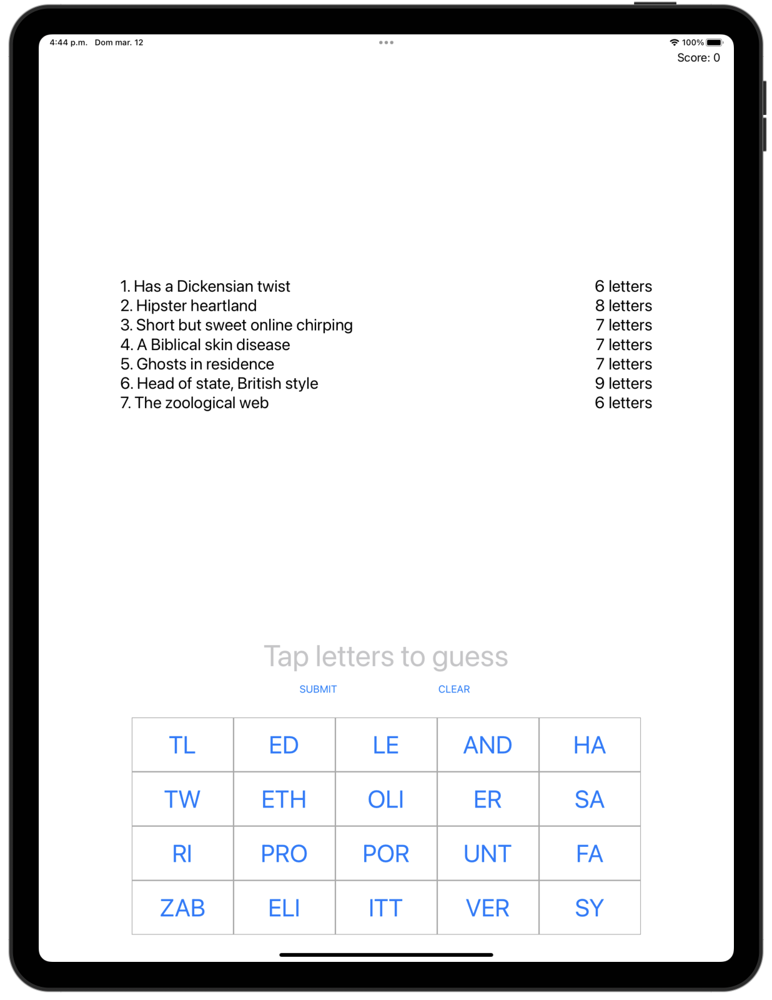

# 7 Swifty Words

[Project 8](https://www.hackingwithswift.com/read/8/overview) from the [100 Days of Swift course](https://www.hackingwithswift.com/100) by [Hacking With Swift](https://www.hackingwithswift.com/).

## Contents

|                      Day                      | Contents                                                                                                                                                                                                                                                                                   |
|:---------------------------------------------:|:-------------------------------------------------------------------------------------------------------------------------------------------------------------------------------------------------------------------------------------------------------------------------------------------|
| [36](https://www.hackingwithswift.com/100/36) | <ul><li>[Setting up](https://www.hackingwithswift.com/read/8/1/setting-up)</li><li>[Building a UIKit user interface programmatically](https://www.hackingwithswift.com/read/8/2)</li></ul>                                                                                                 |
| [37](https://www.hackingwithswift.com/100/37) | <ul><li>[Loading a level and adding button targets](https://www.hackingwithswift.com/read/8/3)</li><li>[It's play time: firstIndex(of:) and joined()](https://www.hackingwithswift.com/read/8/4)</li><li>[Property observers: didSet](https://www.hackingwithswift.com/read/8/5)</li></ul> | 
| [38](https://www.hackingwithswift.com/100/38) | <ul><li>[Wrap up](https://www.hackingwithswift.com/read/8/6/wrap-up)</li><li>[Review for Project 8: 7 Swifty Words](https://www.hackingwithswift.com/review/hws/project-8-7-swifty-words)</li></ul>                                                                                        |

## I've learnt...

- `didSet()` use case.
- `enumerated()`: Turns an array into a map. ID is the position and the value is the content.
- Array's method `joined()`. 
- `replacingOcurrences()`: Same as `replace()` in Java
- `AutoLayout` fully in code.

## Challenges

Taken from [here](https://www.hackingwithswift.com/read/8/6/wrap-up):

>- [x] Use the techniques you learned in project 2 to draw a thin gray line around the buttons view, to make it stand out from the rest of the UI.
>- [x] If the user enters an incorrect guess, show an alert telling them they are wrong. You’ll need to extend the `submitTapped()` method so that if `firstIndex(of:)` failed to find the guess you show the alert.
>- [x] Try making the game also deduct points if the player makes an incorrect guess. Think about how you can move to the next level – we can’t use a simple division remainder on the player’s `score` any more, because they might have lost some points.
>- [x] ([Day 40](https://www.hackingwithswift.com/read/9/6)) Modify project 8 so that loading and parsing a level takes place in the background. Once you’re done, make sure you update the UI on the main thread!
>- [x] ([Day 58](https://www.hackingwithswift.com/read/15/5/wrap-up)) Go back to project 8 and make the letter group buttons fade out when they are tapped. We were using the isHidden property, but you'll need to switch to alpha because isHidden is either true or false, it has no animatable values between.

## To do as a personal challenge...

- [ ] Add more files

## Screennshots

