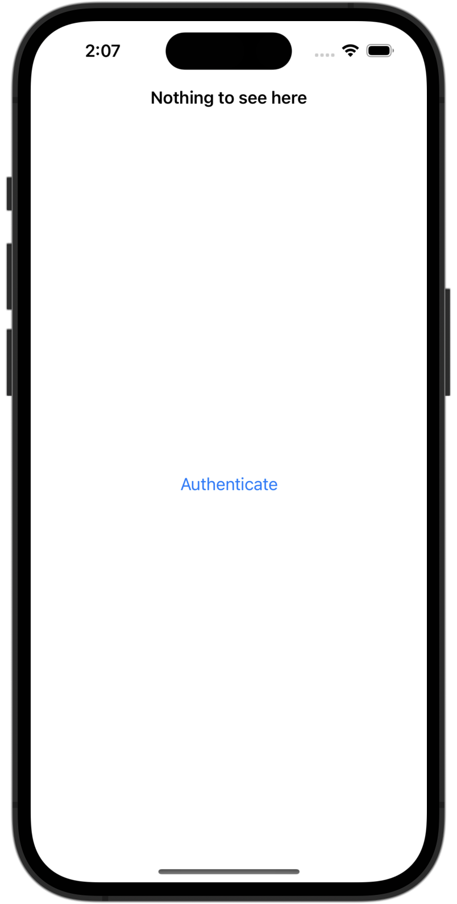
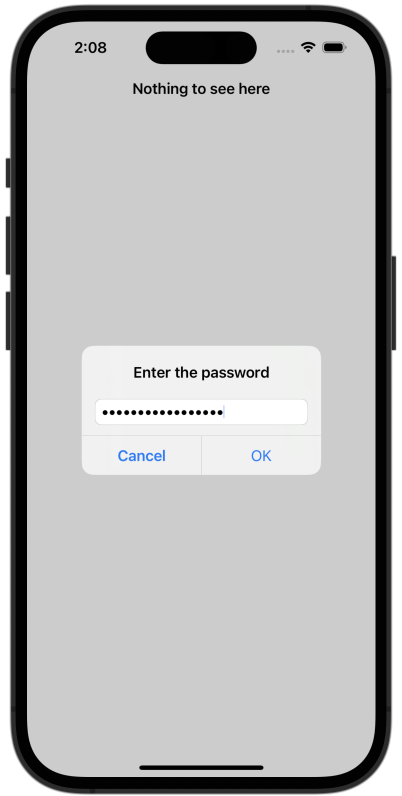
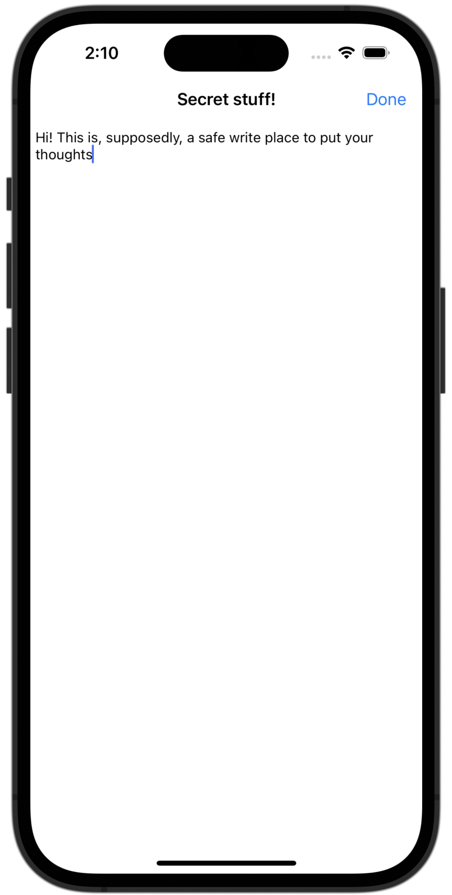
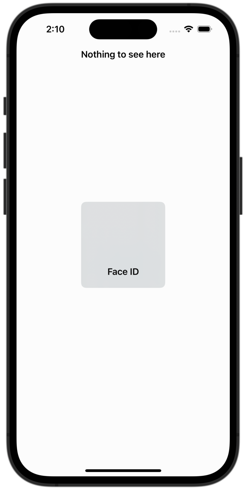

# Secret Swift

[Project 28](https://www.hackingwithswift.com/read/28/overview) from the [100 Days of Swift course](https://www.hackingwithswift.com/100) by [Hacking With Swift](https://www.hackingwithswift.com/).

## Contents

|                      Day                      | Contents                                                                                                                                                                                                                                                                                                                                                                            |
|:---------------------------------------------:|:------------------------------------------------------------------------------------------------------------------------------------------------------------------------------------------------------------------------------------------------------------------------------------------------------------------------------------------------------------------------------------|
| [92](https://www.hackingwithswift.com/100/92) | <ul><li>[Setting up](https://www.hackingwithswift.com/read/28/1/setting-up)</li><li>[The basic text editor](https://www.hackingwithswift.com/read/28/2)</li><li>[Writing somewhere safe: the iOS keychain](https://www.hackingwithswift.com/read/28/3)</li><li>[Touch to activate: Touch ID, Face ID and LocalAuthentication](https://www.hackingwithswift.com/read/28/4)</li></ul> |
| [93](https://www.hackingwithswift.com/100/93) | <ul><li>[Wrap up](https://www.hackingwithswift.com/read/28/5)</li><li>[Review for Project 28: Secret Swift](https://www.hackingwithswift.com/review/hws/project-28-secret-swift)</li></ul>                                                                                                                                                                                          |

## I've learnt...

- Biometric authentication through Face ID and Touch ID using `LocalAuthentication`
- Keychain access using `KeychainWrapper` library.
- The Keychain is a secure storage mechanism in iOS that allows us to store sensitive information, such as passwords, authentication tokens, and cryptographic keys, in an encrypted format. The keychain is designed to protect this sensitive information from unauthorized access, both by other apps and by the user.

## Challenges

Taken from [here](https://www.hackingwithswift.com/read/28/5):

>- [x] Add a Done button as a navigation bar item that causes the app to re-lock immediately rather than waiting for the user to quit. This should only be shown when the app is unlocked.
>- [x] Create a password system for your app so that the Touch ID/Face ID fallback is more useful. You'll need to use an alert controller with a text field like we did in project 5, and I suggest you save the password in the keychain!
>- [x] Go back to [project 10](https://github.com/HenestrosaConH/100-days-of-swift/tree/main/Courses/10-NamesToFaces) and add biometric authentication so the user’s pictures are shown only when they have unlocked the app. You’ll need to give some thought to how you can hide the pictures – perhaps leave the array empty until they are authenticated?

## Screenshots

